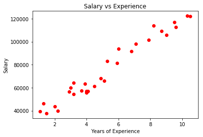
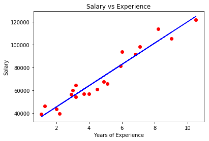
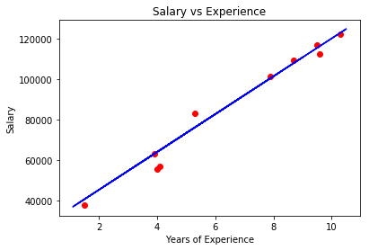

### Simple Linear Regression Intuition

**Simple linear regression** is a statistical method that allows us to summarize and study relationships between two continuous variables:
- One variable denoted X, is regarded as independent vaiable.
- The other variable, denoted y, is regarded as the dependent variable.

**Formula**:
$$y = b_0 + b_1 * X_1$$

### Simple Linear Regression Implimentation 

Here we use a simple dataset to train a simple linear regression model. The dataset contains the year of working experences and the salary for each working years.


```python
# Importing the Libaraies
import numpy as np
import matplotlib.pyplot as plt
import pandas as pd

# Importing the Dataset
dataset = pd.read_csv('Salary_Data.csv')
X = dataset.iloc[:, :-1].values
y = dataset.iloc[:, 1].values
```


```python
# Show X - The year of working experiences
X
```


    array([[  1.1],
           [  1.3],
           [  1.5],
           [  2. ],
           [  2.2],
           [  2.9],
           [  3. ],
           [  3.2],
           [  3.2],
           [  3.7],
           [  3.9],
           [  4. ],
           [  4. ],
           [  4.1],
           [  4.5],
           [  4.9],
           [  5.1],
           [  5.3],
           [  5.9],
           [  6. ],
           [  6.8],
           [  7.1],
           [  7.9],
           [  8.2],
           [  8.7],
           [  9. ],
           [  9.5],
           [  9.6],
           [ 10.3],
           [ 10.5]])


```python
# Show y - The salary reflected by the working experiences
y
```


    array([  39343.,   46205.,   37731.,   43525.,   39891.,   56642.,
             60150.,   54445.,   64445.,   57189.,   63218.,   55794.,
             56957.,   57081.,   61111.,   67938.,   66029.,   83088.,
             81363.,   93940.,   91738.,   98273.,  101302.,  113812.,
            109431.,  105582.,  116969.,  112635.,  122391.,  121872.])


```python
%matplotlib inline
```


```python
# Plot the dataset
plt.scatter(X, y, color = 'red')
plt.title('Salary vs Experience')
plt.xlabel('Years of Experience')
plt.ylabel('Salary')
plt.show()
```





From the diagram we can see that he dataset is following some kind of linear relationship between X and y. Our goal is to find a model that could fit the data perfectly.


```python
# Splitting the dataset into Training set and Test set
from sklearn.model_selection import train_test_split
X_train, X_test, y_train, y_test = train_test_split(X, y, test_size = 1/3, random_state = 0)

# Fitting Simple Linear Regression to the Training set
# Scikit-Learn does the feature scaling for us so we do not need to do that
from sklearn.linear_model import LinearRegression
regressor = LinearRegression()
regressor.fit(X_train, y_train)

# Predict the Test set result
y_pred = regressor.predict(X_test)

# Print y_pred
y_pred
```


    array([  40835.10590871,  123079.39940819,   65134.55626083,
             63265.36777221,  115602.64545369,  108125.8914992 ,
            116537.23969801,   64199.96201652,   76349.68719258,
            100649.1375447 ])


```python
# Compare with y_test
y_test
```


    array([  37731.,  122391.,   57081.,   63218.,  116969.,  109431.,
            112635.,   55794.,   83088.,  101302.])


```python
# Viualising the Training set result
plt.scatter(X_train, y_train, color = 'red')
plt.plot(X_train, regressor.predict(X_train), color = 'blue')
plt.title('Salary vs Experience')
plt.xlabel('Years of Experience')
plt.ylabel('Salary')
plt.show()
```





```python
# Viualising the Test set result
plt.scatter(X_test, y_test, color = 'red')
plt.plot(X_train, regressor.predict(X_train), color = 'blue')
plt.title('Salary vs Experience')
plt.xlabel('Years of Experience')
plt.ylabel('Salary')
plt.show()
```





By using Scikit-Learn LinearRegression module, we trained out model with X_train, y_train. And we found our Simple Linear Regression model showing as the blue line in above two diagrams. In the last diagram we can see our model fits the test dataset very well. 
